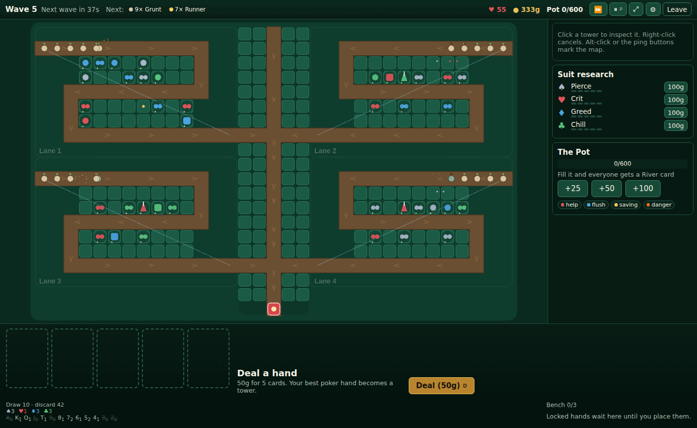

# Poker TD

A standalone, online multiplayer tower defense game inspired by the classic
**Poker Defense / PokerTD** StarCraft custom maps. You pay gold to be dealt
poker hands, and the hand you make decides which tower you get. Hold your lane
with friends in co-op, or raise gold against rivals in Showdown.

**Status:** playable end to end, in the browser and as a desktop app. Solo with
bot allies, online co-op (1–6), Showdown (2–8), Quick Play, the Daily Deal,
replays and a tutorial. What's left needs people: playtests, a public
deployment, and commissioned art and music. See the [Roadmap](docs/ROADMAP.md).



## Play it locally

Requires Node 22.12+ and pnpm 10 (`corepack enable`).

```sh
pnpm install
pnpm start          # builds the client and serves everything on http://localhost:8787
```

Or for development with hot reload:

```sh
pnpm dev            # client on http://localhost:5173 (proxies to the server on :8787)
```

To play online with friends for free, host it from your PC and share a free
Cloudflare tunnel link: see [Host from your own PC](docs/DEPLOY.md#host-from-your-own-pc-free).

### Controls

| Key                | Action                                                  |
| ------------------ | ------------------------------------------------------- |
| `D`                | Deal (50 gold)                                          |
| `1`–`5`            | Mark cards for a redraw                                 |
| `R`                | Redraw marked cards                                     |
| `Space`            | Lock the hand; the tower goes to your bench             |
| Click              | Place a tower / select a tower                          |
| Right-click, `Esc` | Cancel                                                  |
| `U` / `S` / `T`    | Upgrade / sell / change targeting of the selected tower |
| `Q`                | Research your main suit                                 |
| `Tab` (hold)       | Scoreboard                                              |
| `H`                | Hand rankings                                           |
| `F`                | Zoom to your lane; wheel zooms, drag pans               |
| `P`                | Vote to pause (co-op)                                   |
| `N`                | Send the next wave early (solo)                         |

All keys can be rebound in Settings.

## Docs

The docs include diagrams (Mermaid, rendered by GitHub) and screenshots of the game.

| Doc                                          | What it covers                                                   |
| -------------------------------------------- | ---------------------------------------------------------------- |
| [Game Design](docs/GAME_DESIGN.md)           | Vision, pillars, core loop, modes, maps, progression, UX         |
| [Mechanics & Balance](docs/MECHANICS.md)     | Cards, hands to towers, suits, upgrades, enemies, waves, economy |
| [Balance report](docs/BALANCE.md)            | Bot-measured win rates, guardrails, and what changed             |
| [Technical Design](docs/TECHNICAL_DESIGN.md) | Architecture, simulation, netcode, protocol, testing (as built)  |
| [Deploying](docs/DEPLOY.md)                  | Docker, configuration, endpoints, capacity, backups              |
| [Roadmap](docs/ROADMAP.md)                   | Milestones, what's done, and what still needs people             |

## Repository

```
packages/sim        deterministic game rules: cards, evaluator, waves, combat, views, replays
packages/sim/data   tuning data: towers, enemies, waves, rules, sends, maps (JSON)
packages/protocol   client/server messages (zod-validated, msgpack on the wire)
packages/bots       greedy / smart / raiser bots and a headless match runner
apps/server         Node server: rooms, match loop, profiles (SQLite), quick play, replays
apps/client         Vite + PixiJS + Preact browser client (also runs offline modes)
apps/desktop        Tauri desktop wrapper
tools/              balance runner, load test, end-to-end browser test
```

## Commands

| Command                                  | What                                                                |
| ---------------------------------------- | ------------------------------------------------------------------- |
| `pnpm check`                             | Lint, format check, typecheck, unit/integration tests               |
| `pnpm e2e`                               | Real server + Chromium end-to-end test                              |
| `pnpm balance --runs 60 --check`         | Bot balance run with guardrails (see [BALANCE.md](docs/BALANCE.md)) |
| `pnpm loadtest --rooms 100`              | Server load test                                                    |
| `pnpm odds "AH KH 7H 2C 9H" --redraw 2C` | Exact redraw odds for a hand                                        |
| `docker build -t pokertd .`              | Production image (see [DEPLOY.md](docs/DEPLOY.md))                  |

The simulation must stay deterministic. ESLint blocks `Math.random`, `Date` and
timers in `packages/sim/src`, so all randomness goes through seeded RNG streams.

The earlier single-player Godot prototype is in git history (commit `3af8b17`).
