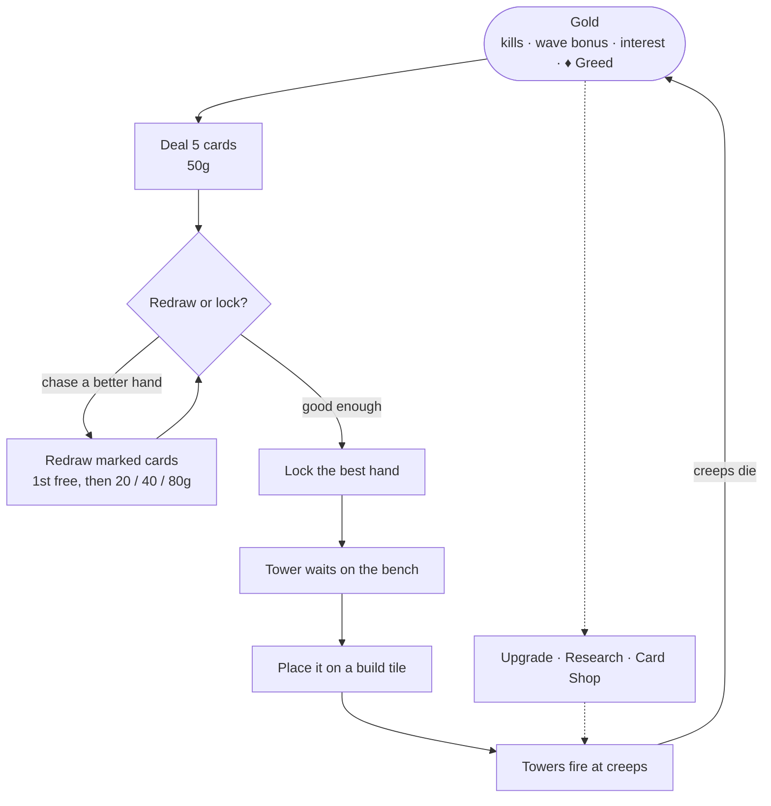
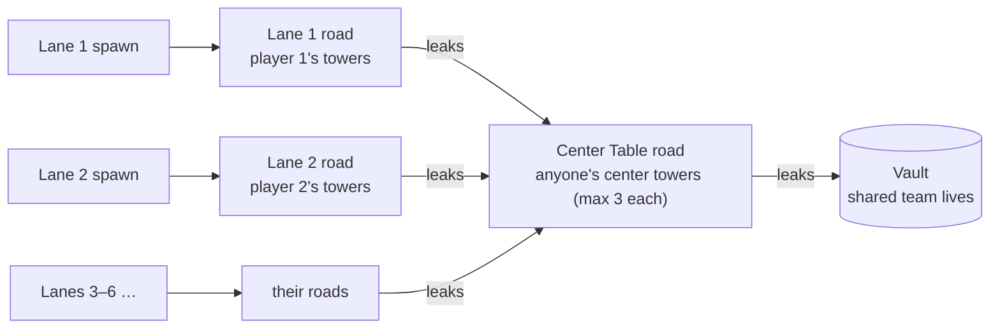
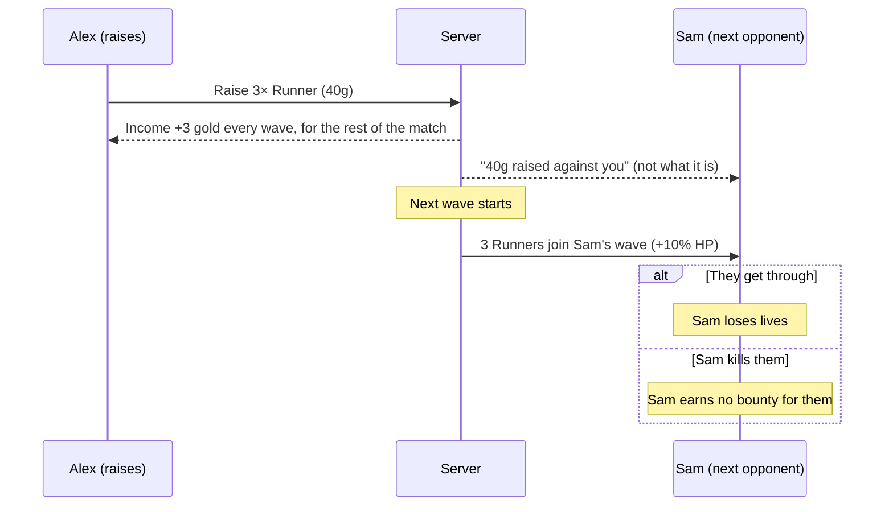
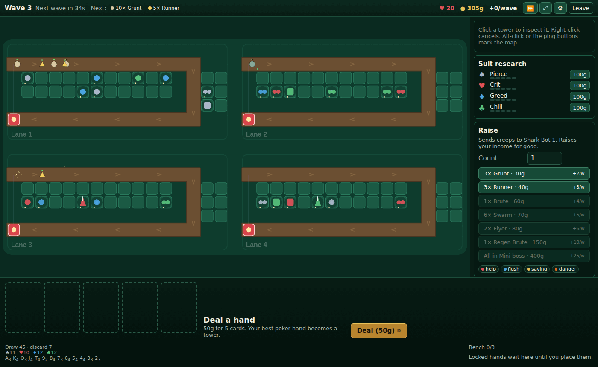
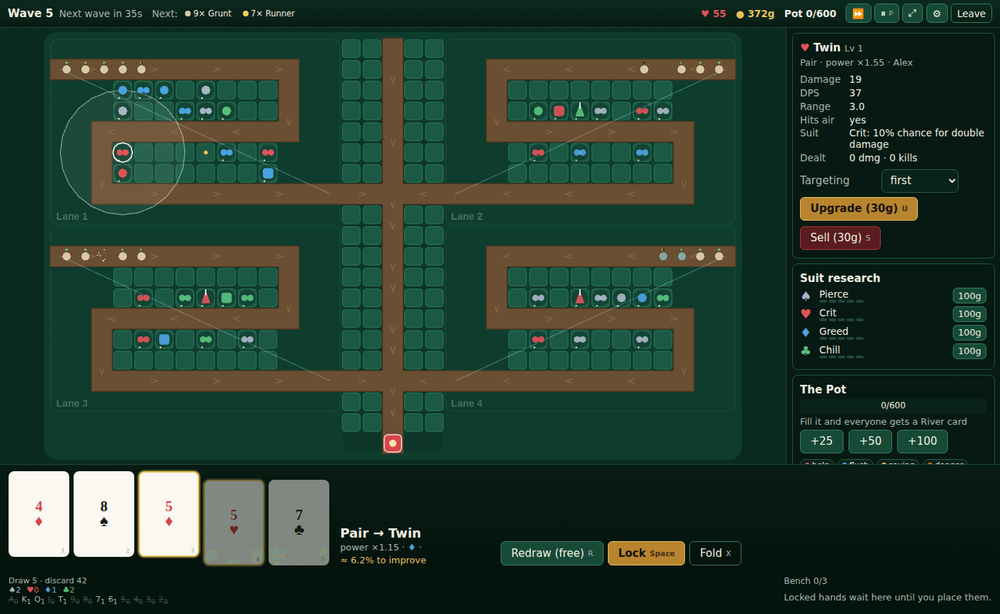
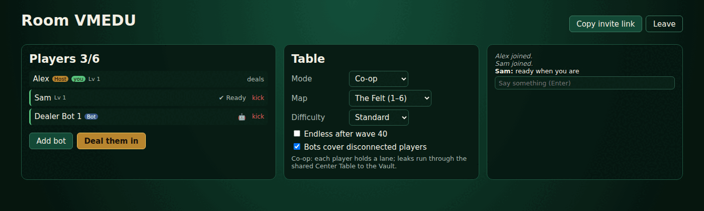

# Game Design Document

## 1. Vision

In **Poker TD**, poker is the build system of a tower defense game. You don't
buy towers from a menu. You buy _chances_: gold becomes cards, and cards
become towers. The tension of a poker table (do I redraw for the flush, or
lock the safe pair?) runs alongside the pressure of a wave closing in on your
defenses.

It's a standalone, online-first multiplayer game that keeps what made the
StarCraft _Poker Defense_ maps loved: lane defense, random hands deciding
towers, co-op chaos, and friends cheering a lucky royal flush. It adds real
netcode, reconnects, balance built on data, and modern UX.

### Target experience

- **Session length:** 25–40 min for a standard co-op match and 15–25 min for Showdown.
- **Players:** 1–6 co-op, or 2–8 versus.
- **Platform:** browser first (a shared link joins the lobby), then a desktop build (Steam).
- **Audience:** TD fans, custom-map nostalgia players, and poker/roguelike-deckbuilder fans (Balatro crowd).

## 2. Design pillars

1. **Every deal is a decision.** Deals, redraws and locks should be meaningful
   choices under time pressure, not slot-machine pulls. Luck sets the table and
   skill plays the hand.
2. **Big hands are big moments.** Rare hands must feel spectacular to see and
   hear, and they must make a real difference in the game. A royal flush is an event the whole lobby sees.
3. **Readable chaos.** Many towers and many creeps, but you can always tell
   what's hitting what, where the leaks are, and what the next wave brings.
4. **Better together.** Co-op systems (the center table, card passing, the
   Pot) reward coordinating over playing alone in the same lobby.
5. **Fair online play.** The server is authoritative, hidden information stays
   hidden, and it's hard to cheat.

## 3. Core loop

- **Micro loop (seconds):** deal, then evaluate, then redraw or lock, then place.
- **Wave loop (~45 s):** a countdown, then the wave spawns, then you defend and
  keep dealing during the wave. The next countdown overlaps the end of the
  wave, so the pressure never fully stops.
- **Match loop (~40 waves):** build an engine: suit research, card shop tweaks
  to your deck, and a composition of tower families that fits the enemy mix.
- **Meta loop (across matches):** cosmetics, card backs, table themes, stats,
  unlockable _House Rules_ (mutators) and _Jokers_. No pay-to-win power.

## 4. Game modes

### 4.1 Co-op Defense (flagship)

- 1–6 players, and each player owns one **lane**.
- Every lane runs the same wave schedule. Creeps that get through a lane
  enter the **Center Table**, a shared road that leads to the Vault.
- Every player may build on the **Center Table slots** (limited, first come
  first served, max 3 per player). Those towers are the team's second chance.
- Creeps that reach the Vault drain the **shared team life pool** (15 + 10 per player on Standard).
- Bosses spawn in **every lane** every 10 waves. Whatever gets through meets the
  Center Table, so the team's shared towers matter most on boss waves.
  (Originally bosses spawned only on the Center Table; bot tests showed the
  center towers alone couldn't kill them.)
- Co-op tools:
  - **Slip:** once per wave, pass one card from your current (unlocked) hand
    to a teammate. It replaces a card of their choice on their next redraw.
  - **The Pot:** anyone can chip gold into a team pot. When it fills, every
    player draws a **River Card**: a free extra card on the next deal, so they pick the best 5 of 6.
  - **Pings:** help, going for a flush, saving gold, and danger markers.
- Win: survive wave 40 (the final boss). **Endless** is a room option that keeps going after wave 40.

Where a creep goes in co-op:

### 4.2 Showdown (versus)

- 2–8 players FFA, or 2v2 / 3v3 / 4v4 teams, each in an identical lane.
- **Raise:** spend gold to queue extra creeps into an opponent's (or the next
  opponent's) lane for the next wave. Raising **permanently increases your
  income** (Legion TD style), so it's both an investment and an attack.
- **Bluff:** opponents see _how much_ was raised against them (chip stack
  size) but not _what_ until the wave spawns.
- Leaks cost your own lives. At 0 lives you **bust** and are out of the game.
  Busted players can spectate or sit in as a _Dealer's Ghost_, who can place
  1 cosmetic ping per wave.
- Last player (or team) standing wins. After wave 25 there is **Sudden Death**:
  creep HP increases 10% per wave.

How a raise plays out:

### 4.3 Solo / Practice

- Co-op with 1 player and optional bot allies (the same bots used for balance testing).
- **Daily Deal:** a fixed seed and fixed deck order for everyone that day, with a leaderboard.

### 4.4 Later / experimental (post-launch)

- **Hold'em:** each player holds 2 hole cards per deal. Community cards
  (flop/turn/river) are revealed on a timer and are shared by the whole
  table. Your tower is the best 5 of 7.
- **Ranked Showdown** with seasons.
- **Custom lobbies with House Rules** (e.g. "Jokers wild", "No redraws",
  "Double speed", "Short deck: 6 through A only").

## 5. Maps

| Map             | Players    | Notes                                                     |
| --------------- | ---------- | --------------------------------------------------------- |
| **The Felt**    | 1–6        | Lanes on both sides of the Center Table road. Default.    |
| **Riverboat**   | 1–4        | Long winding lanes.                                       |
| **Vegas Strip** | 2–8 versus | Parallel straight lanes, easy to read for Showdown.       |
| **Back Room**   | 1–3        | Small and tight with few build tiles, for expert players. |

Map rules:

- Grid-based. The path is fixed and never mazed (this matches the original and
  keeps it readable). Build tiles sit next to the path.
- 24–37 build tiles per lane (32 on The Felt), so tiles are a real constraint
  by the late game, and selling and replacing weak towers becomes a decision.
- Some **Hot Tiles** give a small bonus (+10% range or +10% damage), which gives
  placement some depth.

## 6. Progression and retention

- **Account level** from matches played, waves survived, and big hands made.
- **Unlocks (sidegrades or cosmetic only):** card backs, table felt, tower
  skins, VFX colors, emotes, the _House Rules_ catalog, and extra starting
  Jokers for custom lobbies.
- **Collection / Hand Book:** track the first time you make each hand and suit
  combo. Royal flushes are logged with match, date and wave.
- **Stats:** win rate, highest wave, most common hand, luckiest deal.

## 7. UX and presentation

- **Art direction:** a casino-noir table. The map reads as a felt table from a
  top-down view, towers are chip stacks and dealer figures, and creeps are
  stylized critters. Readability comes before detail.
- **Hand UI:** 5 large cards at the bottom. Click cards to mark them for
  redraw, and the current hand rank and resulting tower preview update live.
  The deck tracker shows remaining counts by rank and suit, so card counting
  is a skill and not a memory test.
- **Big-hand moments:** Four of a Kind and above trigger a slow-mo card flip,
  a stinger sound, and a lobby-wide banner ("Alex hit a ROYAL FLUSH ♥").
- **Wave preview:** the next wave's composition, armor type and
  flying/boss flags are always visible.
- **Accessibility:** colorblind suit symbols (shape plus color, 4-color deck
  option), scalable UI, rebindable hotkeys, reduced-motion toggle.
- **Hotkeys:** `D` deal, `1–5` toggle cards, `R` redraw, `Space` lock,
  `Q/W/E` upgrade/sell/target mode, `Tab` scoreboard.

## 8. Onboarding

1. An interactive tutorial (5 min) teaches deal, lock, place, then redraw,
   suits, and finally research.
2. The first 3 waves of any match for level 1–3 accounts show contextual tips.
3. A hand-ranking cheat sheet is always one key away (`H`).

## 9. Monetization (tentative)

Premium one-time purchase on Steam and free to play in the browser with
cosmetic-only unlocks, or fully premium. **Never** sell cards, redraws or
power. Decide by M5.

## 10. Open design questions

- Should co-op lives be shared or per-player? The current choice is **shared**
  for the team feel. Test per-player-with-rescue as an alternative.
- Is a redraw count of 1 free plus paid ones right, or should redraws be a
  per-wave pool?
- Should Slip be available in Showdown team modes?
- Is 40 waves too long for a first-time player? Consider a 25-wave "Quick" preset.
