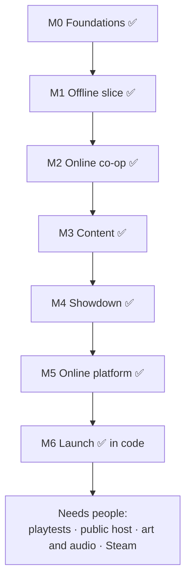

# Roadmap

Milestones are ordered by **risk**: prove the card-to-tower loop offline, then
pay for netcode, then content and meta. Each milestone has **exit criteria**.

## Status at a glance

Everything that can be built and verified by code and automated tests is done.
What remains needs **people, accounts or artists**: playtests, a public
deployment, OAuth and Steam accounts, commissioned art and music, and business
decisions.

| Milestone            |            Built            | Automated checks                                  | Needs people / accounts                                  |
| -------------------- | :-------------------------: | ------------------------------------------------- | -------------------------------------------------------- |
| M0 Foundations       |             ✅              | CI, exhaustive evaluator test                     | —                                                        |
| M1 Offline slice     |             ✅              | Bot guardrails pass                               | External playtests                                       |
| M2 Online co-op      |             ✅              | Server tests, 2-browser e2e, load test            | Public deploy with TLS; 4 players on real networks       |
| M3 Content           |             ✅              | Guardrails on all maps and difficulties           | Playtest win rates                                       |
| M4 Showdown          |             ✅              | 8-player FFA sims, raise-style spread < 10 points | Human Showdown sessions                                  |
| M5 Online platform   | ✅ (guest accounts, SQLite) | Server tests                                      | OAuth apps, beta week, retention data, monetization call |
| M6 Polish and launch |         ✅ in code          | e2e, phone layout                                 | Art/audio commission, Steam page, trailer                |

Legend below: `[x]` done, `[~]` done differently than planned (see note), `[ ]` open.

---

## M0: Foundations — done

- [x] pnpm monorepo: `packages/sim`, `packages/protocol`, `apps/client`, `apps/server`
- [x] TS strict, ESLint + Prettier, Vitest, GitHub Actions CI (lint, typecheck, test)
- [x] Seeded RNG with streams, fixed-tick loop, state hash util
- [x] Card model, deck (draw/discard/reshuffle), **hand evaluator** with exhaustive test
- [x] Odds tool CLI (`pnpm odds "AH KH 7H 2C 9H" --redraw 2C`)
- [x] Data loading for towers, enemies, waves, rules and maps

**Exit:** met. The evaluator matches all 2,598,960 five-card hands; same seed, same deals.

## M1: Offline vertical slice — built

- [x] Map "The Felt", path rendering, build tiles, the Vault
- [x] Deal → redraw → lock → place flow, hand UI, live hand preview, deck tracker, redraw odds
- [x] Towers (all 11, not just 6), creeps (all 9), 40 waves with bosses
- [x] Card power (rank) and suit affinity; suit effects for ♠♥♦♣
- [x] Tower levels, sell, targeting modes
- [x] Economy: bounty, wave bonus, interest
- [x] VFX/SFX: projectiles, lightning, beams, splash, death bursts, big-hand banner, synthesized audio
- [x] `pnpm balance` with greedy and smart bots, and balance reports
- [~] The offline sim runs on the main thread, not a Web Worker: a whole 6-player
  match costs well under a millisecond per tick, so a worker wasn't worth the complexity.

**Exit:** guardrails met (greedy bot clears wave 15 in 100% of runs and never wins).
**Open:** 5+ external playtesters and the "one more run" signal. The kill/pivot
checkpoint still applies to those playtests.

## M2: Online co-op — built

- [x] Node room server, `ws` transport, msgpack plus zod-validated intents
- [x] Lobby codes, join by URL (`/play/CODE`), ready-up, host settings
- [x] 10 Hz snapshots with tower deltas and slow-changing detail every 2 s, client interpolation, private hands
- [x] Multi-lane maps with the **Center Table** and shared lives
- [x] Reconnect with a seat token and full resync; bot takeover after the grace period
- [x] Pings and chat
- [x] Offline mode speaks the same protocol in the browser (single UI code path)
- [x] Deployable: Dockerfile (tested: builds, serves, health check, persistent volume)
- [ ] Deployed to a public host with TLS (needs an account; see [DEPLOY.md](DEPLOY.md))

**Exit (automated part) met:** two browsers finish setup and play together
in e2e; reconnect mid-match is tested; the load test shows a p99 tick of
0.18 ms per room (target: under 5 ms). **Open:** 4 players on different real networks.

## M3: Content complete for co-op — built

- [x] All 11 towers, including Laser, Storm, Crown and Jester. Jokers
- [x] All creep types plus modifiers. 40-wave schedule, bosses at w10/20/30, final boss "The House"
- [x] Suit research. Card Shop (Burn, Mark, Paint, Promote, Joker, Extra Redraw, Bench Slot)
- [x] Co-op tools: **Slip** and **The Pot / River Card**
- [~] Bench: a capacity (slots + 1) instead of a placement timeout; deals are blocked
  while the bench is full, and towers can be scrapped for 30%
- [x] Maps: The Felt (1–6), Riverboat (1–4), Back Room (1–3)
- [x] Difficulty presets, Endless mode
- [x] Smart bot, bot allies in solo, nightly balance CI with guardrails
- [x] Interactive tutorial

**Exit (automated part) met:** smart bots win a full 40-wave match 79–92% on
Standard (Back Room 38–54%), and no tower family exceeds ~35% of damage.
**Open:** the 30–50% human win-rate target needs playtests. Bots play better than
the average human, so their high win rates are expected.

## M4: Showdown (versus) — built

- [x] Raises with the income system; targets see gold raised, not the creeps (Bluff)
- [x] FFA targeting (next opponent clockwise) and teams (any split, set by the host)
- [x] Bust, spectating, Sudden Death after wave 25
- [x] Map: Vegas Strip (2–8)
- [x] Bot opponents that raise
- [x] End-of-match scoreboard

**Exit (automated part) met:** 8-player FFA runs to completion in sims. Median
match is 18 minutes. Raise-style win rates are within 7 points (only 2 bot
styles exist, not 4). **Open:** human Showdown sessions.

## M5: Online platform — built

- [~] Accounts: guest profiles with a device token. No OAuth yet (needs
  Discord/Google/Steam app registrations)
- [~] Storage: **SQLite** (`node:sqlite`) instead of Postgres. Profiles, match
  history, stats and the Hand Book all live in one module, so a Postgres move is contained
- [x] Quick Play for co-op (fills to 4 or starts after 20 s) and Showdown (fills to 4, bots top up)
- [x] Replays stored per match, served over HTTP, in-client viewer with seek, speed and any seat's view
- [x] Daily Deal with a leaderboard
- [x] Moderation: mute, report (stored), chat filter, rate limits
- [~] Metrics: a JSON `/metrics` endpoint and client error reports in structured logs; no dashboards
- [ ] Decide monetization (GDD §9): a business decision
- [ ] Public beta: 100+ concurrent players for a week, day-7 retention

## M6: Polish and launch — built in code

- [~] Art: a consistent vector style drawn in code (towers by family and suit,
  creeps by type, felt themes). A commissioned art pass is still open
- [~] Audio: synthesized effects and a generative music loop. Composed music is still open
- [x] Accessibility: four-color deck, colorblind suit markers, reduced motion, rebindable keys, UI scale
- [x] Phone layout; the renderer handles hundreds of creeps. 60 fps on low-end GPUs is not yet measured
- [x] Account levels, XP, cosmetic card backs and felts unlocked by level
- [x] Tauri desktop build (Linux .deb verified; Windows/macOS build from the same config)
- [ ] Steam page, achievements, Steam lobby/invite integration (needs a Steamworks account)
- [x] Localization-ready strings (English table)
- [ ] Trailer and store assets

---

## Post-launch backlog

- **Hold'em mode** (community cards)
- Ranked Showdown with seasons and ELO/Glicko
- House Rules editor and custom lobbies browser
- Map editor (`tools/map-editor`) and community maps
- New tower families via special hands (e.g. "Flush House", "Five Aces")
- Weekly mutator events
- Spectator casting tools
- OAuth sign-in and cross-device profiles; Postgres when one SQLite file is no longer enough

## Risks and mitigations

| Risk                                                 | Impact                | Mitigation                                                                                               |
| ---------------------------------------------------- | --------------------- | -------------------------------------------------------------------------------------------------------- |
| Loop feels like pure luck                            | Core fun fails        | Redraws, deck tracker, odds hints, Card Shop deck-shaping. **Playtest next**                             |
| Balance explodes with 11 towers × 4 suits × research | Degenerate strategies | Data-driven numbers, nightly bot sims with guardrails, damage-share reports                              |
| Bots overstate how easy it is                        | Too hard for humans   | Treat bot win rates as an upper bound; tune difficulty with playtest data                                |
| Too few players to fill lobbies                      | Dead queues           | Bots fill Quick Play, solo with bot allies, lobby links, Daily Deal                                      |
| One SQLite file, one process                         | Scale ceiling         | ~1,100 six-player rooms per core measured; move storage to Postgres and add a matchmaker before sharding |
| IP confusion with the original maps                  | Legal/branding        | Original name, art and content. "Inspired by" only. No Blizzard assets                                   |
