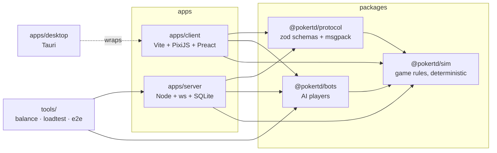
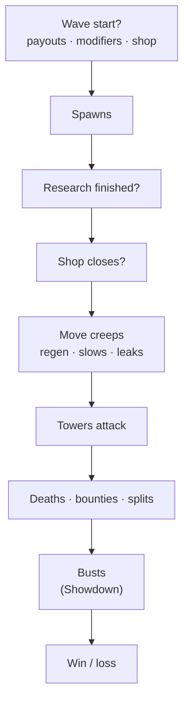
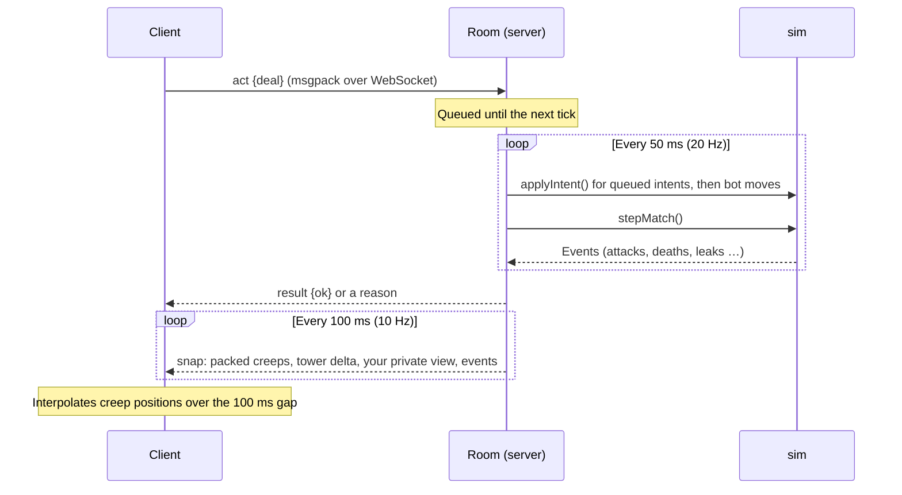
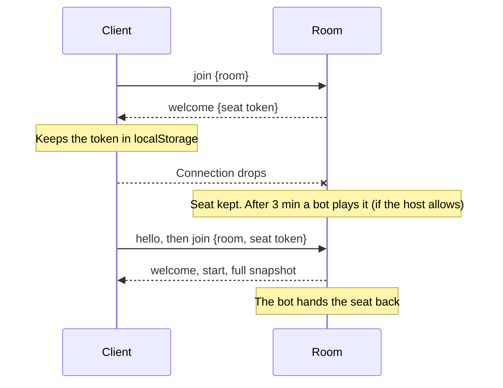
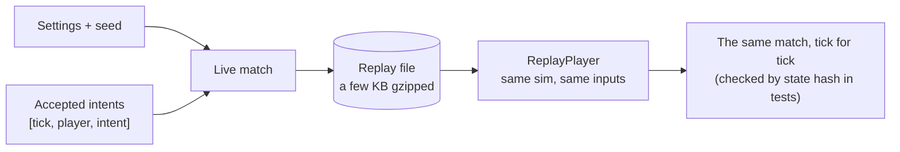
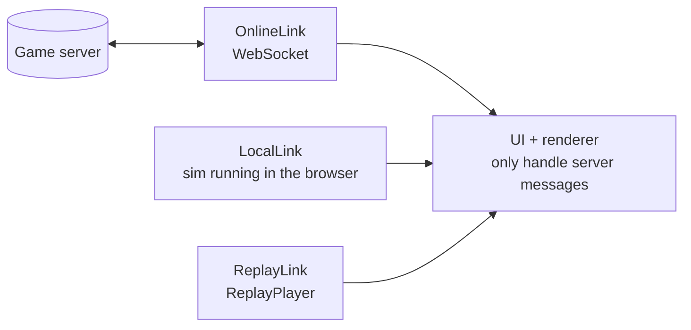

# Technical Design

This describes the system **as built**. Where the build differs from the
original plan, a note says so and why.

## 1. Goals and constraints

- **Online multiplayer first:** 1–6 co-op and 2–8 versus, over the public internet.
- **Server authoritative:** hidden decks, no client-trusted gold or damage.
- **Zero-install entry:** someone shares a lobby link and a friend plays in the browser.
- **Deterministic simulation:** replays, bot balance testing, desync debugging and the Daily Deal.
- **Solo-dev friendly:** one language end to end and minimal ops.

## 2. Stack

| Layer            | Choice                                                             | Notes                                                                                                   |
| ---------------- | ------------------------------------------------------------------ | ------------------------------------------------------------------------------------------------------- |
| Language         | **TypeScript** (strict, 6.0) everywhere                            | TS 7 is out, but typescript-eslint does not support it yet                                              |
| Monorepo         | **pnpm workspaces**                                                | No Turborepo: builds are fast enough without caching                                                    |
| Simulation       | `packages/sim`, **no dependencies**                                | Runs in Node, the browser and balance child processes                                                   |
| Bots             | `packages/bots`                                                    | Bot allies, disconnect takeover, balance runs                                                           |
| Server           | **Node 22** + `ws` + a small room manager                          | No Colyseus: the room code is ~400 lines                                                                |
| Persistence      | **SQLite** via `node:sqlite`                                       | Planned as Postgres. One file, no native build step; all SQL lives in `db.ts`/`profiles.ts`/`server.ts` |
| Client rendering | **PixiJS v8**                                                      | Vector art drawn in code                                                                                |
| Client UI        | **Preact** + signals                                               | DOM overlay for menus, hand, panels                                                                     |
| Audio            | **WebAudio**, synthesized                                          | Planned as Howler.js; synthesis means no asset files                                                    |
| Build            | **Vite 8**                                                         | Dev server proxies `/ws` and the API to the game server                                                 |
| Wire format      | **zod** validation, **msgpackr** encoding                          | Intent schemas are type-checked against the sim's `Intent` type                                         |
| Tests            | **Vitest**, a Playwright e2e script, bot balance runs, a load test |                                                                                                         |
| Desktop          | **Tauri 2** (`apps/desktop`)                                       | Wraps the web client; offline modes work without a server                                               |
| Deploy           | **Dockerfile** (one container: server + static client)             | See [DEPLOY.md](DEPLOY.md)                                                                              |

## 3. Repository layout

```
apps/
  client/            Vite + PixiJS + Preact
    src/net/         links: online (WebSocket), local (in-browser host), replay
    src/state/       signals store; turns server messages into UI state
    src/render/      board renderer: map, towers, creeps, effects, input
    src/ui/          menu, lobby, game HUD, hand, overlays, settings, tutorial
    src/audio/       synthesized sound effects and music
    src/i18n/        string table
  server/            Node server
    src/server.ts    HTTP endpoints, WebSocket handling, message routing
    src/room.ts      lobby, authoritative match loop, snapshots, reconnects
    src/matchmaker.ts, db.ts, profiles.ts, moderation.ts, metrics.ts, replays.ts
  desktop/           Tauri wrapper
packages/
  sim/               the game rules (deterministic)
    src/cards/       card model, deck, evaluator, odds
    src/core/        seeded RNG, fixed-step timing, state hash
    src/data/        typed loaders + cross-validation for data/*.json
    src/map/         lane templates → multi-lane layouts
    src/match/       state, intents, waves, combat, towers, views, replays
    data/            towers, enemies, waves, rules, sends, maps/*.json
  protocol/          message schemas and codec
  bots/              greedy / smart / raiser bots, placement, headless runner
tools/
  balance.ts         pnpm balance: bot matches in parallel → report, CSV, guardrails
  loadtest.ts        pnpm loadtest: many rooms through the real room code
  e2e.mjs            pnpm e2e: real server + Chromium
```

How the packages depend on each other (arrows point at what a package uses):



**The rule:** `packages/sim/src` never uses `Math.random`, `Date`, timers or
anything async (ESLint enforces it). All randomness goes through seeded RNG
streams stored in the match state, and all time is ticks.

## 4. Simulation model

- **Fixed timestep:** 20 ticks/s. `stepMatch(state)` advances one tick;
  `applyIntent(state, player, intent)` validates and applies one player action.
- **State** (`MatchState`) is plain serializable data: settings, tick, phase,
  wave (number, next start tick, modifiers, spawn queue), shared lives, players
  (gold, deck, hand, bench, research, income, raises…), towers, creeps, pot,
  shop, pause votes, RNG stream states, and the events produced this tick.
- **Maps are lane templates.** `buildLayout(map, players)` places one lane per
  player. In co-op, lanes mirror around the Center Table road, and each lane's
  exit path continues to the Vault. In Showdown, lanes sit in a grid, each with its own vault.
- **Creeps live on paths:** `(path, dist)`. Movement is `dist += speed × (1 − slow) × dt`.
  A co-op creep that finishes its lane continues on that lane's center path.
- **Targeting** scans the creeps in the tower's zone (its lane, or the Center
  Table) when the tower is ready to fire. Planned as precomputed coverage
  intervals; a direct scan is cheap enough (p99 0.18 ms per room tick).
- **Hits resolve instantly**; the client animates projectiles from `attack` events.
- **Tick order:** wave start (payouts, modifiers, spawn queue, shop) → spawns →
  research → shop close → movement/regen/slow/leaks → tower attacks → deaths,
  bounties and splits → busts → win/loss.
- **Derived tower stats** (Jester copies, Crown auras, levels, hot tiles,
  research, Fog) are recomputed whenever an input changes.

The order of one tick:



### 4.1 Hand evaluation

- `score5` packs category and tiebreak ranks into one comparable number with
  no allocation. It checks all 2,598,960 hands in about a second.
- Decks can hold duplicates (Mark), so flushes coexist with pairs, and Five of a
  Kind is possible.
- Jokers (max 2) are resolved by trying every substitution.
- `redrawOdds` enumerates exactly when the number of outcomes is small, and
  samples otherwise. It powers the CLI, the client's odds hint and the smart bot.

## 5. Randomness and hidden information

- The match seed comes from the server (or the day, for the Daily Deal).
  Streams: `deck:<player>`, `waves`, `combat`, `shop`. Stream states live in the
  match state, so snapshots and replays capture them.
- Deck order is **never** sent. A player's snapshot includes their own hand,
  deck counts (for the deck tracker) and their deck's contents (sorted, for the
  Card Shop). Other players are public summaries only.
- Showdown raises show targets a gold total only; the creeps appear when the wave spawns.

## 6. Networking

### 6.1 Model

Server-authoritative simulation. Clients send intents; the server applies
them at the start of the next tick and broadcasts snapshots. There's no client
prediction (TD input isn't twitchy). Card marking and placement previews are
local until submitted.

- **Snapshots at 10 Hz**, built per client:
  - creeps packed 9 bytes each (id, type, path, dist, HP fraction, flags);
  - towers as a **delta** (changed and removed) against what that client has;
  - the player list every 0.4 s; stats, next-wave preview and deck contents every 2 s;
  - the client's private view (hand, bench, deck counts, shop offers) every snapshot.
- **Events** ride along with each snapshot (attacks, deaths, leaks, waves, big hands…).
  A reshuffle event only goes to its owner.
- **Measured:** about 7.6 KB/s per player in a 6-player game.
  Planned: "delta against the last acked snapshot". Per-field cadence and tower
  deltas got under the target without acks.
- **Interpolation:** the client lerps each creep's `dist` over the 100 ms snapshot gap.



### 6.2 Protocol (v2)

Client → server (zod-validated): `hello` (guest login), `rename`, `create`,
`join` (optional seat token or spectate), `leave`, `ready`, `settings`, `team`,
`addBot`, `kick`, `start`, `rematch`, `quickPlay`, `cancelQueue`, `daily`,
`act { intent }`, `ping`, `chat`, `report`.

Gameplay intents: `deal`, `redraw`, `lock`, `fold`, `place`, `scrap`, `upgrade`,
`sell`, `target`, `research`, `shopBuy`, `slip`, `pot`, `raise`, `pauseVote`, `callWave`.

Server → client: `profile`, `welcome`, `lobby`, `left`, `start`, `snap`,
`result` (per intent), `end`, `queue`, `chat`, `ping`, `reject`.

Limits: 4 KB messages, 30 messages/s per connection, chat 5 per 10 s, 3 rooms per IP.

### 6.3 Rooms

- A room is a lobby, then a match, then (optionally) a rematch with the same seats.
- **Codes** are 5 characters with no 0/O/1/I. Join via `/play/CODE`.
- **Reconnect:** `welcome` gives each seat a secret token (kept in
  localStorage). Rejoining with it reclaims the seat and gets a full resync.
- **Disconnects:** after 3 minutes (or right away for a deliberate leave), a
  smart bot plays the seat if the host allows it. It hands back if the player returns.
- **Pause:** co-op majority vote, 2 minutes per match.

Reconnecting:



- **Quick Play:** fills to 4, or starts after 20 s (co-op) or 30 s (Showdown, topped up with bots).
- **Daily Deal:** a private solo room seeded by the UTC date. Best result per player per day.

### 6.4 Scaling

One process, one event loop. A 25 ms timer advances every playing room with
real elapsed time (catching up at most 10 ticks). Measured: about 1,100
six-player rooms per core. The next steps, when needed: move storage to
Postgres, then run several processes behind a matchmaker that assigns rooms.

## 7. Replays

- `Replay = { version, sim, settings, inputs: [tick, player, intent][], result }`.
  Only accepted intents are recorded, including bot moves.
- The server saves every match gzipped (a few KB) and serves `/replays/:id`.
  Offline matches keep the last 10 in localStorage.
- `ReplayPlayer` re-runs the sim from the seed. A server test checks that a
  replay reproduces the exact state hash of the live match.



- The viewer supports play/pause, 1–8× speed, seeking (by replaying forward),
  and watching through any seat's eyes, hand included.

## 8. Testing

| Layer    | What                                                                                                                                                               |
| -------- | ------------------------------------------------------------------------------------------------------------------------------------------------------------------ |
| Unit     | Exhaustive evaluator, cards, RNG, deck, odds, formulas, data validation, map layouts                                                                               |
| Sim      | Hand flow, placement rules, waves, combat, splitters, air, research, Crown/Jester/Laser, shop, Pot, Slip, River, Showdown raises and busts, snapshots, determinism |
| Protocol | Round trips, invalid messages, random bytes                                                                                                                        |
| Server   | Profiles, lobbies, host rules, a real match over WebSockets, reconnect, replays, chat filter, Quick Play, Daily Deal, error reports                                |
| Bots     | Greedy holds past wave 15, smart wins, determinism, Showdown                                                                                                       |
| e2e      | `pnpm e2e`: real server + Chromium, covering solo, two-browser co-op, Showdown, the shop, the end screen and replays                                               |
| Balance  | `pnpm balance --check`, nightly in CI ([BALANCE.md](BALANCE.md))                                                                                                   |
| Load     | `pnpm loadtest`: rooms × bots through the real room code                                                                                                           |

## 9. Client

- **Links:** `OnlineLink` (WebSocket with backoff reconnect and room rejoin),
  `LocalLink` (runs the match in the browser and emits the same messages as the
  server; used for solo, practice and the tutorial), `ReplayLink`. The UI only
  handles server messages, so every mode shares one code path.



- **Renderer layers:** map (drawn once per match), placement overlay, towers
  (redrawn only on change), creeps (interpolated), effects, floating text.
  Effects and floating text are capped. Reduced motion trims particles.
- **Input:** click to place or select, right-click to cancel, drag to pan, wheel
  to zoom, F to focus your lane, and rebindable keys for everything else.
- The offline sim runs on the main thread. Planned for a Web Worker; not needed at
  the measured cost.

## 10. Security and fair play

- The server owns all state; clients only send intents, and every intent is
  validated against the rules.
- Hidden information (deck order, other hands, raise contents) is never serialized to others.
- Guest tokens are stored hashed (SHA-256). Seat tokens are per room.
- Chat filter, mute (client side), reports stored in the database, rate limits, per-IP room limits.

## 11. Observability

- `GET /metrics`: rooms, playing rooms, connections, tick p50/p99, bytes/s,
  matches started/finished, disconnects, rejected messages.
- Browser errors are posted to `/client-errors` and logged as structured JSON.
- Planned but not built: dashboards and an external error service. Both need infrastructure choices.
